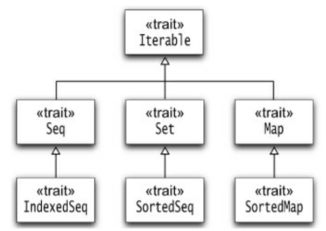

# Collections

## Main Collections Traits 

{title="Courtesy \"Scala for the Impatient\" by Cay Horstmann."}

## `Iterable`s

An `Iterable` is any collection that can yield an `Iterator`, which allows you to systematically access each element of the collection (see the [Iterator Pattern](https://en.wikipedia.org/wiki/Iterator_pattern)).

### Example

```scala
val coll = Array(1, 7, 2, 9) // some Iterable
val iter = coll.iterator
while (iter.hasNext)
  println(iter.next())
```

## `Seq`uences

- A `Seq` is an ordered sequence of values like an array or a `List`.
- An `IndexedSeq` allows fast random access through an integer index.

### Example

An `ArrayBuffer` is an `IndexedSeq` but a `LinkedList` is not.

## `Set`s

- A `Set` is an **ordered** collection of values.
- A `SortedSet` maintains an **sorted** visitation order.
    - Elements are traversed in sorted order.

## `Map`s

- A `Map` is a set of $(\mathit{key},\mathit{value})$ pairs.
- A `SortedMap` maintains a sorted visitation order by the keys.

## Constructing Collections

Each Scala collection trait or class has a companion object with an `apply` method that constructs instances of the collection.

### Example

```scala
Iterable(0xFF, 0xFF00, 0xFF0000)
Set(Color.RED, Color.GREEN, Color.BLUE)
Map(Color.RED -> 0xFF0000, Color.GREEN -> 0xFF00, Color.BLUE -> 0xFF)
SortedSet("Hello", "World")
```

## Converting Between Collection Types

- Can use `toSeq`, `toSet`, `toMap`, etc. to convert between collection types.
- There is also a *generic* `to[C]` for type `C` (the *target* collection type).

```scala
val col = mutable.ArrayBuffer(1, 1, 2, -4, 2, 100)
val set = col.toSet
val list = col.to[List]
```

## Mutable and Immutable Collections

- As we have seen previously, you can make both *mutable* and *immutable* collection objects.
- An *immutable* collection never changes.
  - Allows safe reference sharing in concurrent programs.
    - No data *races* since there are no (concurrent) data *writes*.

### Example

- `scala.collection.mutable.Map`
- `scala.collection.immutable.Map`

### Immutability Preference

The preference is to immutability.

#### Example

```scala
val map = Map("Hello" -> 42) // : Map[String, Int] = Map("Hello" -> 42)
map.getClass() // : Class[T] = class scala.collection.immutable.Map$Map1
```

## Using Immutable Collections

Compute the set of all digits of an integer:

```scala
def digits(n: Int): Set[Int] = n match {
    case _ if n < 0 => digits(-n)
    case _ if n < 10 => Set(n)
    case _ => digits(n / 10) + (n % 10)
}

digits(1729) // : Set[Int] = Set(1, 7, 2, 9)
```