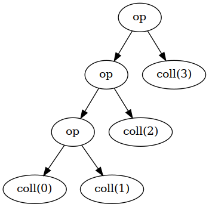
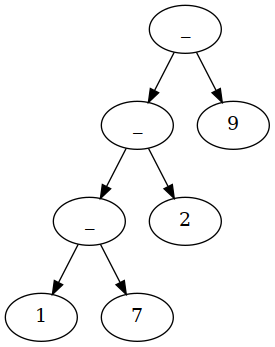
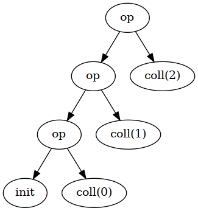
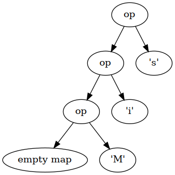

# Collections

## Main Collections Traits 

```plantuml
hide members
interface Iterable << trait >>
interface Seq << trait >>
interface Set << trait >>
interface Map << trait >>
interface IndexedSeq << trait >>
interface SortedSet << trait >>
interface SortedMap << trait >>

Iterable <|-- Seq
Seq <|-- IndexedSeq
Iterable <|-- Set
Set <|-- SortedSet
Iterable <|-- Map
Map <|-- SortedMap
```

## `Iterable`s

An `Iterable` is any collection that can yield an `Iterator`, which allows you to systematically access each element of the collection (see the [Iterator Pattern](https://en.wikipedia.org/wiki/Iterator_pattern)).

### Example

```scala
val coll = Array(1, 7, 2, 9) // some Iterable
val iter = coll.iterator
while (iter.hasNext)
  println(iter.next())
```

## `Seq`uences

- A `Seq` is an **ordered** sequence of values like an array or a `List`.
- An `IndexedSeq` allows fast random access through an integer index.

### Example

An `ArrayBuffer` is an `IndexedSeq` but a `LinkedList` is not.

## `Set`s

- A `Set` is an **unordered** collection of values.
- A `SortedSet` maintains an **sorted** visitation order.
    - Elements are traversed in sorted order.

## `Map`s

- A `Map` is a set of $(\mathit{key},\mathit{value})$ pairs.
- A `SortedMap` maintains a sorted visitation order by the keys.

## Constructing Collections

Each Scala collection trait or class has a companion object with an `apply` method that constructs instances of the collection.

### Example

```scala
Iterable(0xFF, 0xFF00, 0xFF0000)
Set(Color.RED, Color.GREEN, Color.BLUE)
Map(Color.RED -> 0xFF0000, Color.GREEN -> 0xFF00, Color.BLUE -> 0xFF)
SortedSet("Hello", "World")
```

## Converting Between Collection Types

- Can use `toSeq`, `toSet`, `toMap`, etc. to convert between collection types.
- There is also a *generic* `to[C]` for type `C` (the *target* collection type).

```scala
val col = collection.mutable.ArrayBuffer(1, 1, 2, -4, 2, 100)
val set = col.toSet
val list = col.to[List]
```

## Mutable and Immutable Collections

- As we have seen previously, you can make both *mutable* and *immutable* collection objects.
- An *immutable* collection never changes.
  - Allows safe reference sharing in concurrent programs.
    - No data *races* since there are no (concurrent) data *writes*.

### Example

- `scala.collection.mutable.Map`
- `scala.collection.immutable.Map`

### Immutability Preference

The preference is to immutability.

#### Example

```scala
val map = Map("Hello" -> 42) // : Map[String, Int] = Map("Hello" -> 42)
map.getClass() // : Class[T] = class scala.collection.immutable.Map$Map1
```

## Using Immutable Collections

Compute the set of all digits of an integer:

```scala
def digits(n: Int): Set[Int] = n match {
    case _ if n < 0 => digits(-n)
    case _ if n < 10 => Set(n)
    case _ => digits(n / 10) + (n % 10)
}

digits(1729) // : Set[Int] = Set(1, 7, 2, 9)
```

## Sequences

```plantuml
hide members
interface Seq << trait >>
interface IndexedSeq << trait >>
Seq <|-- IndexedSeq
IndexedSeq <|.. Vector
IndexedSeq <|.. Range
Seq <|.. List
Seq <|.. Stream
Seq <|.. Stack
Seq <|.. Queue
```

- A `Vector` is the **immutable** equivalent of an `ArrayBuffer`. 
- A `Range` is an integer sequence, e.g., `1 to 10` or `10.to(30, 10)`.

## Lists

- A list is either `Nil` (empty) or an object with a `head` and a `tail`.
- The `tail` is *also* a `List`.
- Similar to the `car` and `cdr` operations in Lisp.

```scala
val lst = List(4, 2) // : List[Int] = List(4, 2)
lst.head // : Int = 4
lst.tail // : List[Int] = List(2)
lst.tail.head // : Int = 2
lst.tail.tail // : List[Int] = List()
```

### Creating `List`s

You can use `::` to create a `List` with a given `head` and `tail`:

```scala
9 :: List(4, 2)
9 :: 4 :: 2 :: Nil
9 :: (4 :: (2 :: Nil)) // right-associative.
```

- All of these create a `List(9, 4, 2)`.
- Similar to the `cons` operator in Lisp for constructing lists.

## Summing `List`s

Natural fit for recursion:

```scala
def sum(lst: List[Int]): Int =
  if (lst == Nil) 0 else lst.head + sum(lst.tail)

sum(List(9, 4, 2)) // : Int = 15
```

Use pattern matching:

```scala
def sum(lst: List[Int]): Int = lst match {
  case Nil => 0
  case h :: t => h + sum(t) // h is lst.head, t is lst.tail
}

sum(List(9, 4, 2)) // : Int = 15
```

This is just for demonstration purposes. Should really just use the built-in method:

```scala
List(9, 4, 2).sum // : Int = 15
```

## `Set`s

- A `Set` is an *unordered* collection of unique elements.
- Adding an element to a `Set` that already exists in the `Set` has no effect.

```scala
Set(2, 0, 1) + 1 == Set(2, 0, 1) // : Boolean = true
Set(2, 0, 1) + 4 == Set(2, 0, 1, 4) // : Boolean = true
```

- Ordering is *not* guaranteed.
- By default, implemented as *hash sets*.
  - Constant-time look-up.

### `LinkedHashSet`s

Elements are traversed in the order for which they were inserted:

```scala
val weekdays = scala.collection.mutable.LinkedHashSet("Mo", "Tu", "We", "Th", "Fr")
weekdays.mkString(", ") // : String = Mo, Tu, We, Th, F
```

### `SortedSet`s

Elements are traversed in the *sorted* order:

```scala
val nums = collection.immutable.SortedSet(5, 2, -2, 5, 2, -100)
nums.mkString(", ") // : String = -100, -2, 2, 5
```

## `Set` Operations

### Containment

```scala
val digits = Set(1, 7, 2, 9)
digits contains 0 // : Boolean = false
```

### Subset

```scala
Set(1, 2) subsetOf digits // : Boolean = true
```

### Union, Intersection, and Set Difference

```scala
val primes = Set(2, 3, 5, 7)
digits union primes // : Set[Int] = Set(5, 1, 9, 2, 7, 3)
digits & primes // : Set[Int] = Set(7, 2)
digits -- primes // : Set[Int] = Set(1, 9)
```

## Operations for Adding or Removing Elements

### Adding Elements

#### Immutable Collections

- `+` is used for adding elements to *unordered* collections.

```scala
var numberSet = Set(1, 2, 3)
numberSet += 5 // Sets numberSet to the immutable set numberSet + 5
```

- `+:` and `:+` are for pre-pending and appending elements to *ordered* collections, respectively.

```scala
Vector(1, 2, 3) :+ 5  // : Vector[Int] = Vector(1, 2, 3, 5)
1 +: Vector(1, 2, 3) // : Vector[Int] = Vector(1, 1, 2, 3)
```

#### Mutable Collections

```scala
val numbers = ArrayBuffer(1, 2, 3) // : ArrayBuffer[Int] = ArrayBuffer(1, 2, 3)
numbers += 5 // : ArrayBuffer[Int] = ArrayBuffer(1, 2, 3, 5)
```

### Removing Elements

```scala
Set(1, 2, 3) - 2 // : Set[Int] = Set(1, 3)
```

### Working With Multiple Elements

```scala
numbers ++ Vector(1, 2, 7, 9) // : Vector[Int] = Vector(1, 2, 3, 5, 1, 2, 7, 9)
numbers -- Vector(1, 2, 7, 9) // : Vector[Int] = Vector(3, 5)
```

## Mapping a Function

- Used to transform all elements of a collection.
- `map` applies a function to each element of a collection and results in another collection containing the mapped elements.

```scala
val names = List("Peter", "Paul", "Mary")
names.map(_.toUpperCase) // List("PETER", "PAUL", "MARY")
```

Same as:
```scala
for (n <- names) yield n.toUpperCase
```
However, the `map` version is preferred as it is more easily parallelizable (more on this later.)

## Multi-level Mapping

If a function returns a collection, you can "flatten" each of these into a *single* result using `flatMap`.

Consider the following function that returns a collection:

```scala
def ulcase(s: String) = Vector(s.toUpperCase(), s.toLowerCase())
```

Now, let's `map` each of the names to the value produced by this function:

```scala
names.map(ulcase) // : List[Vector[String]] = Vector("PETER", "peter"), Vector("PAUL", "paul"), Vector("MARY", "mary")
```

Suppose we just want a `List` of names rather than a `List` of `Vector`s of names:

```scala
names.flatMap(ulcase) // : List[String] = List("PETER", "peter", "PAUL", "paul", "MARY", "mary")
```

## Other Mapping

### Mutable Mapping

- The previous examples dealt with immutable collections.
- For mutable collections, use `transform` instead of `map`.

### Mapping Partial Functions

- `collect` works with *partial* functions, i.e., those that may not be defined for all inputs.

```scala
"-3+4".collect { case '+' => 1 ; case '-' => -1 } // : Vector[Int] = Vector(-1, 1)
```

### Applying Side-effecting Functions

To apply a function where the return value is not important (e.g., it returns `Unit`), use `foreach`:

```scala
names.foreach(println)
```

Outputs:
```
Peter
Paul
Mary
```

## Reducing

- The functions seen so far are *unary*, i.e., they operate on a single operand.
- We applied such functions to every element of the collection.
- What if we want to *combine* *multiple* values in some way, e.g., using a *binary* function, i.e., a function taking *two* operands?
- The call `c.reduceLeft(op)` applies `op` to successive elements.

{width=25% title="Courtesy \"Scala for the Impatient\" by Cay Horstmann."}

## `reduceLeft`

```scala
List(1, 7, 2, 9).reduceLeft(_ - _)
```

{width=20% title="Courtesy \"Scala for the Impatient\" by Cay Horstmann."}

Expands to: `((1 - 7) - 2) - 9 = 1 - 7 - 2 - 9 = -17`

## `reduceRight`

Does the same but starts at the end of the collection:

```scala
List(1, 7, 2, 9).reduceRight(_ - _)
```

Expands to: `1 - (7 - (2 - 9)) = 1 - 7 + 2 - 9 = -13`

## Folding

:::::::::::::: {.columns}
::: {.column width="50%"}

- Can start the computation with an initial element that is not part of the collection.
- Use `coll.foldLeft(init)(op)`.

> QUESTION: What kind of method is this?

> QUESTION: Why use this kind of method?

{width=50% title="Courtesy \"Scala for the Impatient\" by Cay Horstmann."}

:::
::: {.column width="50%"}

### Example

```scala
List(1, 7, 2, 9).foldLeft(0)(_ - _)
```

Expands to: `0 - 1 - 7 - 2 - 9  = -19`

Can also be written as:

```scala
(0 /: List(1, 7, 2, 9))(_ - _)
```

> QUESTION: What does the `/:` look like?

:::
::::::::::::::

## Folding Instead of Looping

Count the frequencies of letters in a `String`.

- Visit each letter and update a mutable `Map`:

```scala
val freq = scala.collection.mutable.Map[Char, Int]()
for (c <- "Mississippi") freq(c) = freq.getOrElse(c, 0) + 1
```

After this code, `freq` becomes:

```
collection.mutable.Map[Char,Int] = Map(M -> 1, s -> 4, p -> 2, i -> 4)
```
:::::::::::::: {.columns}
::: {.column width="50%"}

- At each step, combine the frequency map and the newly encountered letter, producing a new frequency map:

{ width=42.5% title="Courtesy \"Scala for the Impatient\" by Cay Horstmann."}

:::
::: {.column width="50%"}

- LHS of `op` is the *partially* filled map.
- RHS of `op` is the *new* letter.

```scala
(Map[Char, Int]() /: "Mississippi") {
  (m, c) => m + (c -> (m.getOrElse(c, 0) + 1))
}
```

- `Map[Char, Int]()` is the initial, *empty* map.
- Code in the block is the operation.
- The operation dictates how a *new* map is formed given a *previous* map and a new character.

:::
::::::::::::::

## Scanning

- `scanLeft` and `scanRight` *combine* folding and mapping.
- Obtain a collection of all intermediate results:

```scala
(1 to 10).scanLeft(0)(_ + _) // : collection.immutable.IndexedSeq[Int] = Vector(0, 1, 3, 6, 10, 15, 21, 28, 36, 45, 55)
```

## Zipping

- In the preceding slides, we applied an operation to adjacent elements of a particular collection.
- Zipping is a way to deal with elements of *multiple* collections.

Suppose we want to combine the following two collections:

```scala
val prices = List(5.0, 20.0, 9.95)
val quantities = List(10, 2, 1)
```

Specifically, we want a list of pairs of corresponding elements from each list: `(5.0, 10), (20.0, 2), ...`.

```scala
prices zip quantities // : List[(Double, Int)] = List((5.0,10), (20.0,2), (9.95,1))
```

Apply a function to each pair:

```scala
(prices zip quantities) map { p => p._1 * p._2 } // : List(50.0, 40.0, 9.95)
```

Total price of all items:

```scala
((prices zip quantities) map { p => p._1 * p._2 }) sum // : Double = 99.95
```

## Zipping With Shorter Collections

- If one collection is shorter than the other, the resulting list has a number of elements equal to the shorter list:

```scala
List(5.0, 20.0, 9.95) zip List(10, 2) /// : List[(Double, Int)] = List((5.0,10), (20.0,2))
```

- Can specify defaults for the shorter list using `zipAll`:
    - The two elements specify the defaults for whether the shorter list is the LHS or RHS.

```scala
List(5.0, 20.0, 9.95).zipAll(List(10, 2), 0.0, 1) // : List[(Double, Int)] = List((5.0,10), (20.0,2), (9.95,1))
```

- To correlate the collection indices with the elements, use `zipWithIndex`:

```scala
"Scala".zipWithIndex // : collection.immutable.IndexedSeq[(Char, Int)] = Vector((S,0), (c,1), (a,2), (l,3), (a,4))
```

- The "largest" pair:

```scala
"Scala".zipWithIndex.max // : (Char, Int) = (l,3)
```

- The index of the largest element:

```scala
"Scala".zipWithIndex.max._2 // : Int = 3
```
## Iterators

- Obtain an iterator from a collection with the `iterator` method.
- Not as commonly used as in C++ or Java.
- Iterators are useful for collections that are expensive to fully construct.

### Example

`Source.fromFile` returns an `iterator` to avoid reading an entire file into memory.

## Iterator Examples

### Obtaining an `Iterator`

```scala
val iter = (1 to 10).sliding(3)
```

### Using an `Iterator`

```scala
while (iter.hasNext)
    println(iter.next())
```

Or:

```scala
for (elem <- iter)
    println(elem)
```

#### Output

```
Vector(1, 2, 3)
Vector(2, 3, 4)
Vector(3, 4, 5)
Vector(4, 5, 6)
Vector(5, 6, 7)
Vector(6, 7, 8)
Vector(7, 8, 9)
Vector(8, 9, 10)
```

## Iterator Examples

```scala
val iter = (1 to 10).sliding(3)
```

### Print the Number of Remaining Elements

```scala
println(iter.length) // outputs 8.
```

Obtaining the number of elements "exhausts" the iterator:

```scala
println(iter.hasNext) // Returns false as the iterator is now consumed.
```

### Convert an `Iterator` to a `Collection`

```scala
iter.toArray
iter.toIterable
```

- The collection *starts* at the *current* element.

## Peeking at the Next Element Returned By an `Iterator`

- You can look at the next element of an `Iterator` *without* consuming it.

```scala
val filename = "/usr/share/dict/words"
val iter = scala.io.Source.fromFile(filename).buffered

while (iter.hasNext && iter.head.isUpper)
    iter.next

println(s"First non-uppercase character: ${iter.head}")
```

## `LazyList`s

- Formerly called [`Stream`s in Scala version 2.12.x](https://www.scala-lang.org/api/2.13.3/scala/collection/immutable/Stream.html).
    - [`LazyList`](https://www.scala-lang.org/api/2.13.3/scala/collection/immutable/LazyList.html) is *fully* lazy.
    - `Stream`, in Scala 2.12.x, was only *tail* lazy.
- `Iterator`s are "lazy" alternatives to `Collection`s.
    - Allows piecemeal traversal of `Collection`s, useful for large or computationally intensive collections to construct.
    - Only compute the elements that are needed.
- `Iterator`s are *fragile*.
    - Calls to `next` (and even `length`) **change** the iterator.
- `LazyList` implements an *immutable* linked list.
    -  It's called "lazy" because it computes its elements only when they are needed.
- Because `LazyList`s compute their elements on-demand, they can be **infinite** collections! 
    - **NOTE**: For infinite sequences, some methods (such as `count`, `sum`, `max` or `min`) will not terminate.

## `LazyList` Examples

```scala
def numsFrom(n: BigInt): LazyList[BigInt] = n #:: numsFrom(n + 1)
```

- The `#::` operator is similar to `::` for `List`s.

```scala
val tenOrMore = numsFrom(10) // : LazyList[BigInt] = LazyList(<not computed>)
```

- As you see, no elements are initially computed.
- To compute the first element, call:

```scala
tenOrMore.head // : BigInt = 10
```

- The `tail` is unevaluated:

```scala
tenOrMore.tail // : scala.collection.immutable.LazyList[BigInt] = LazyList(<not computed>)
```

- To keep going, you need to get the `head` to compute values:

```scala
tenOrMore.tail.tail.tail.head // : BigInt = 13
```

## Operating on `LazyList`s

- Operations on `LazyList`s are deferred:


```scala
val squares = numsFrom(1).map(x => x * x)
    // : scala.collection.immutable.LazyList[scala.math.BigInt] = LazyList(<not computed>)
```

- You must call `head` to force the evaluation of the next element:

```scala
squares.head // : scala.math.BigInt = 1
```

- To get multiple elements, you need to invoke operations that *force* the "realization" of the list.
    - As the list may be expensive (or even impossible) to compute fully, you may not want to do this to the **entire** list:

    ```scala
    squares.take(5).foreach(println)
    ```

    Outputs:

    ```
    1
    4
    9
    16
    25
    ```

    Alternatively, `squares.take(5).force` results in `LazyList(1, 4, 9, 16, 25)`.

## Constructing `LazyList`s from `Iterator`s

- You can create a `LazyList` from an `Iterator`.

### Example

- `Source.getLines` returns `Iterator[String]`, which allows you to only visit each line *once*.
- In `LazyList`s, on the other hand, elements are memoized; that is, the value of each element is computed at most once.
    - This allows you to *revisit* elements without incurring additional computation costs.

```scala
import scala.io.Source

val words = Source.fromFile("/usr/share/dict/words").getLines().to(LazyList)

words // : scala.collection.immutable.LazyList[String] = LazyList(<not computed>)
words.head // : String = A
words(5) // : String = AOL's
words // : scala.collection.immutable.LazyList[String] = LazyList(A, A's, AMD, AMD's, AOL, AOL's, <not computed>)
```

- **Be cautious of memoization**; it can eat up memory if you're not careful.

## Lazy Views

- Besides `List`s, other kinds of `Collection`s can also be made "lazy" using the `view` method.
- The `view` method returns a `Collection` whose methods' execution is deferred.

### Example

```scala
import scala.math._

val palindromicSquares = (1 to 1000000).view
    .map(x => x * x)
    .filter(x => x.toString == x.toString.reverse) // : scala.collection.View[Int] = View(<not computed>)
```

- Like `LazyList`s, this `View` also is not yet computed.
- The following call generates enough squares until ten palindromes have been discovered:

```scala
palindromicSquares.take(10).mkString(",") // : String = 1,4,9,121,484,676,10201,12321,14641,40804
```

- Unlike `LazyList`s, the results are not memoized.
    - The computation starts over.
- Like `LazyList`s, the `force` method will force the computation of elements.
- **Caution**: The `apply` method forces evaluation of the *entire* collection.

## Mutating Lazy Views

- You may obtain a view into a part (slice) of a `Collection`.
- Any changes to that view *reflect* in the original `Collection`.

### Example

The following code will set the elements in the given slice to `0` but leave the remaining elements unchanged:

```scala
ArrayBuffer buffer = // ...
buffer.view(10, 20).transform(x => 0)
```
